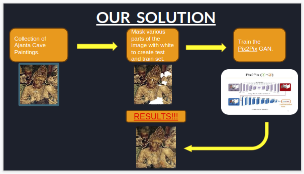

# Tech4Heritage_PHASE_2
Code for T4H Phase 2

## Team : The Eternals
* Sayak Chakraborty
* Amor Iqbal
* Subham Neogi

CS@IIESTS

## PROBLEM STATEMENT 
<ul>
  <li>
Create a system that reads a damaged image (with missing portions).
  </li>
  <li>
Identify the damaged parts.
  </li>
  <li>
Restore the damaged parts using  a model to fill the spaces that are missing using scientific
assumptions drawn out of the sample datasets.
  </li>
</ul>

## OUR SOLUTION

